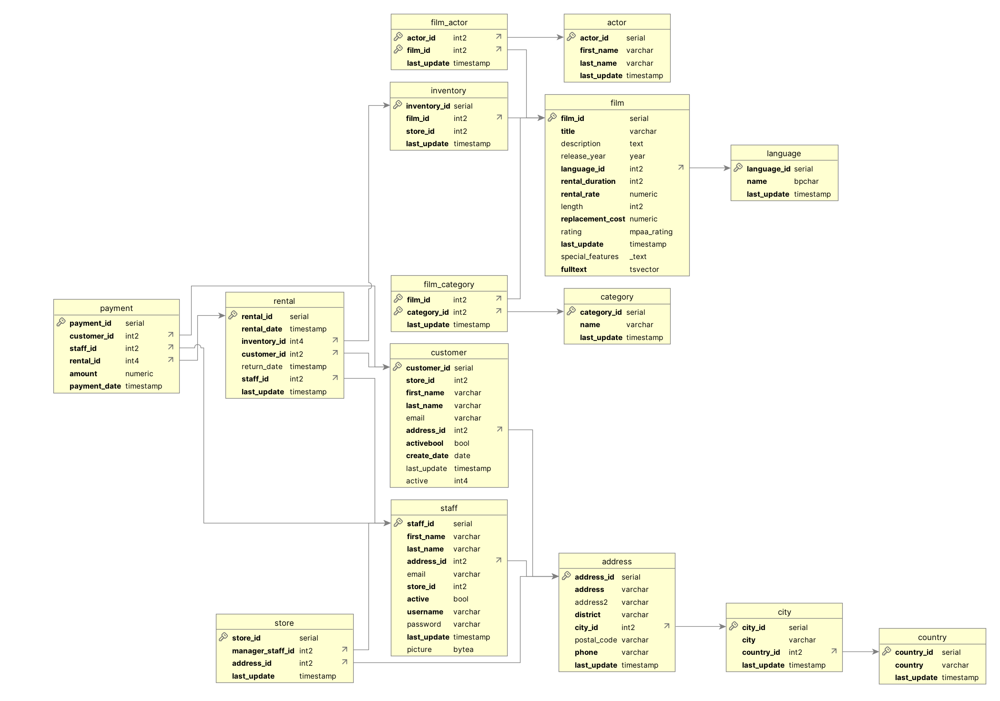
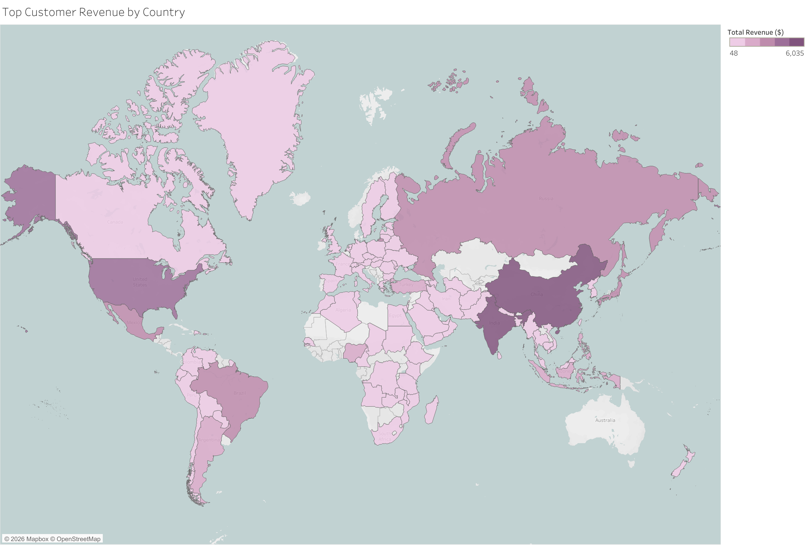
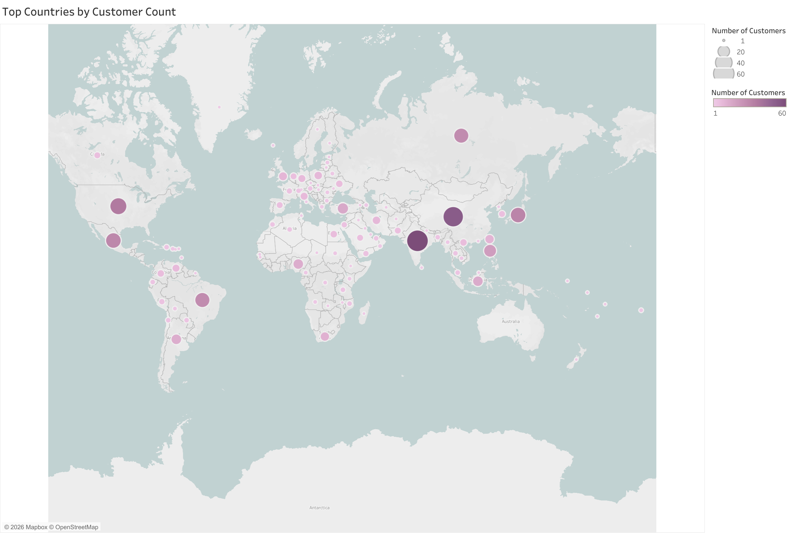

# Rockbuster Stealth SQL Analysis

**Relational database analysis using PostgreSQL to guide streaming service launch strategy for a transitioning movie rental company.**

---

## Project Background

Rockbuster Stealth LLC is a former global movie rental chain facing existential pressure from Netflix and Amazon Prime. The management team plans to leverage existing film licenses to launch a streaming platform but needs data-driven answers on **where to launch first, what content to prioritize, and how to allocate a limited marketing budget**.

As a data analyst on the BI team, I queried Rockbuster's 15-table PostgreSQL database to analyze customer geography, revenue patterns, and content performance across 108 countries. The findings were delivered as a stakeholder presentation to the management board and an interactive Tableau dashboard for ongoing strategic use.

## Data Structure

The Rockbuster database contains **15 interconnected tables** spanning film inventory, customer records, rental transactions, and payment history. The two **fact tables** (payment, rental) connect to **13 dimension tables** through foreign key relationships, enabling analysis across geography, content, and customer segments.

Key tables used in this analysis:
- **payment** → revenue calculations and customer lifetime value
- **rental** → transaction volume and rental duration
- **customer → address → city → country** → geographic segmentation chain
- **film → film_category → category** → genre-level revenue analysis
- **inventory** → film availability by store location

Full schema documentation: [Data Dictionary](reports/Rockbuster_Streaming_Campaign_Data_Dictionary.pdf)

## Executive Summary

Analysis of 599 customers across 108 countries revealed that **customer concentration is high enough to support a phased launch**, with three countries representing the majority of the addressable market. Revenue is driven by a small number of high-performing genres and titles, and high-value customers are distributed globally, meaning the launch strategy must balance geographic density with customer lifetime value.

### Top Findings

**1. Three countries hold 40% of all customers, enabling a focused Phase 1 launch.**
India (60 customers), China (53), and the United States (36) together represent the largest addressable market with minimal geographic spread. Launching in these three markets first captures the highest customer density while keeping operational complexity manageable.

**2. Sports, Sci-Fi, and Animation generate 20%+ higher revenue per rental than the catalog average.**
Sports leads all genres at $4,892 in total revenue, followed by Sci-Fi ($4,336) and Animation ($4,245). The bottom genre (Thriller) generated just $48 — a 100x gap. This signals where licensing investment should be concentrated for the streaming library.

**3. Revenue is heavily concentrated in a small number of hit titles.**
The top 10 films each generate $170–$215 in revenue, while the bottom 10 generate less than $8. This skew means Rockbuster should prioritize acquiring sequel and franchise rights rather than building a large undifferentiated catalog.

**4. High-value customers are spread globally, not clustered in one region.**
The top three customers by lifetime value are located in Réunion ($211.55), the United States ($208.58), and Brazil ($194.61). This distribution means the launch strategy can't rely on a single geography for premium revenue, but a multi-region approach is required from the start.

## Insights Deep Dive

### Market Prioritization

India leads with 60 customers and over $6,000 in total payments, followed by China and the United States. These three Tier-1 markets combine high customer volume with established payment infrastructure, making them natural launch targets. A secondary tier with Japan (31), Mexico (30), Brazil (28), and Russia (28) offers strong expansion potential with lower competitive intensity.

### Content Performance

Genre revenue analysis shows a clear hierarchy: Sports, Sci-Fi, and Animation form the top tier, while Drama, Comedy, and Action provide a profitable middle. Thriller is an extreme outlier at just $48 total revenue. By film rating, PG-13, NC-17, and PG lead revenue, indicating the core audience skews teen-to-adult rather than family-focused.

### Customer Value

Average revenue per customer is $101.50, with a 3x variance across regions. The average rental rate sits at $2.98 with a 5-day rental duration. Top customers contribute $160–$210 each in lifetime value, and their global distribution suggests that premium pricing tiers and loyalty programs should be designed for multi-region deployment rather than localized to one market.

## Recommendations

**Phase 1 — Tier-1 Launch (India, China, United States)**
Launch simultaneously in the three highest-density markets. Allocate 60% of marketing budget here. Localize content libraries with regional film preferences and leverage existing payment infrastructure.

**Phase 2 — Tier-2 Expansion (Japan, Mexico, Brazil)**
Roll out within 6 months of Phase 1. These markets show strong existing customer bases with high lifetime value and lower competitive intensity. Allocate 30% of marketing budget for phased expansion.

**Content Strategy**
Prioritize licensing for Sports, Sci-Fi, and Animation as these genres drive both the highest rental volume and highest revenue. Focus acquisition on proven franchise titles rather than building catalog breadth. Plan the launch library for teen-to-adult audiences (PG-13, PG, NC-17 content) based on current revenue patterns.

**Customer Targeting**
Design acquisition spending by projected CLV per market rather than country size. Build premium and loyalty offerings that work across regions, since high-value customers are not concentrated in a single geography. Target at the city level within priority countries for localized campaigns.

## Tools & Skills

| Tool | Use |
|------|-----|
| PostgreSQL / pgAdmin | Database querying and analysis |
| Tableau Public | Interactive dashboard and geographic visualization |
| DbVisualizer | ERD extraction and schema documentation |
| Excel | Analysis workbook and data profiling with charts |

**SQL techniques demonstrated:** Multi-table JOINs across 15-table schema · Subqueries (nested and correlated) · Common Table Expressions (CTEs) · Aggregate functions with GROUP BY and HAVING · Window functions for ranking and segmentation

## Deliverables

| Document | Description |
|----------|-------------|
| [SQL Query Library](sql-queries/) | 16+ queries covering market analysis, customer segmentation, and revenue metrics |
| [Tableau Dashboard](https://public.tableau.com/app/profile/jess.duong/viz/RockbusterStreamingLaunchCampaign/Story2) | Interactive geographic and revenue analysis |
| [Stakeholder Presentation](reports/Rockbuster_Streaming_Campaign_Final.pdf) | Executive summary with visualizations and strategic recommendations |
| [Data Dictionary](reports/Rockbuster_Streaming_Campaign_Data_Dictionary.pdf) | Complete database schema with field definitions and relationships |
| [Analysis Workbook](reports/Rockbuster_Analysis_Results.xlsx) | Detailed findings with supporting tables and charts |

## Author

**Jessica Duong**  
Data Analyst | [LinkedIn](https://www.linkedin.com/in/jess-duong/) | [Portfolio](https://jess-duong.github.io/) | duong.t.jess@gmail.com

---

*Data source: Rockbuster Stealth PostgreSQL sample database provided by CareerFoundry. Fictional dataset representing a global DVD rental company (599 customers, 108 countries, ~$61K total revenue).*

*For questions about methodology or to discuss this analysis, please reach out via [LinkedIn](https://linkedin.com/in/jessica-duong-35690847/) or open an issue in this repository.*
